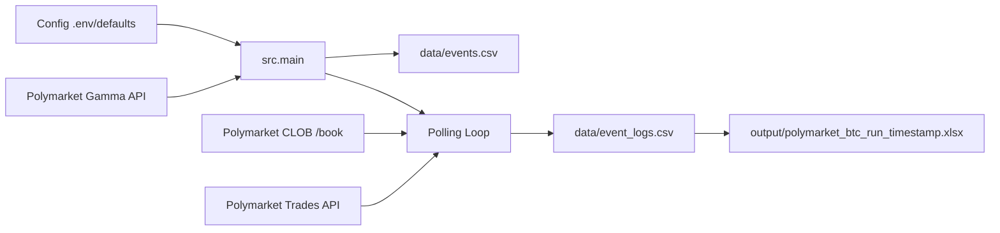
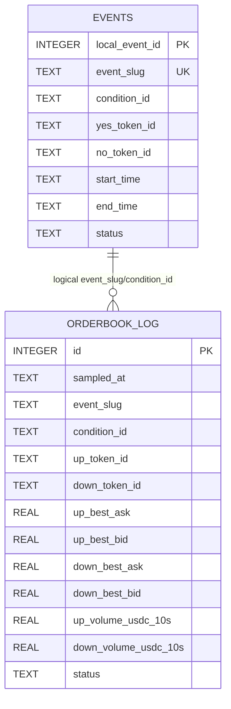

# דוח טכני נוכחי - Polymarket Collector

תאריך סקירה: 13/07/2026  
שורש repository שנבדק: `C:\Users\ASUS\OneDrive\מסמכים\פולימרקט DB`  
סטטוס סימון ממצאים: `מאומת מהקוד`, `מאומת באמצעות בדיקה`, `הערכה`, `לא ניתן לאמת מהקוד הקיים`

## 1. תקציר מנהלים

`מאומת מהקוד` ה-repository כולל שני מימושים נפרדים לאיסוף נתוני Polymarket BTC Up/Down 5m:

1. `polymarket-collector` - אפליקציית FastAPI בקובץ יחיד, עם SQLite מקומי, dashboard בסיסי ו-export ל-Excel.
2. `polymarket-btc-local` - collector מקומי שמריץ דגימה למשך זמן מוגדר, כותב ל-CSV ומייצר Excel בסוף הריצה.

`מאומת מהקוד` מטרת המערכת לפי הקוד היא לאתר שוקי BTC Up/Down 5m ב-Polymarket, למשוך orderbook עבור שני token ids, למשוך trades לפי `condition_id`, לחשב best bid/ask, midpoint, spread ו-volume חלוני, ולשמור snapshot תקופתי.

`מאומת מהקוד` הסטטוס הנוכחי הוא MVP/POC. יש קוד עובד לאיסוף, שמירה ויצוא, אך אין עדיין תשתיות production מלאות: אין monitoring, אין retries מתוחכמים, אין migrations מסודרות, אין בדיקות אוטומטיות מלאות, ואין מנגנון שרידות לאחר restart עבור dedupe של trades.

שלושה חלקים מרכזיים שכבר קיימים:

- `מאומת מהקוד` Discovery של אירועי BTC Up/Down 5m דרך Polymarket Gamma.
- `מאומת מהקוד` דגימת orderbook ו-trades, כולל חישוב volume חלוני לפי Up/Down.
- `מאומת מהקוד` שמירת נתונים ל-SQLite או CSV ויצוא Excel.

שלושה חסרים/סיכונים מרכזיים:

- `מאומת מהקוד` ב-`polymarket-btc-local` dedupe של trades נשמר בזיכרון בלבד, ולכן restart יכול לגרום לספירה חוזרת או לאובדן רציפות חלון.
- `מאומת מהקוד` אין tests ייעודיים לקצה-לקצה, לחלונות זמן, למעבר אירוע או לשגיאות API.
- `מאומת מהקוד` יש שני מימושים מקבילים באותו repository עם סכמות שונות, תדירויות שונות ומנגנוני persistence שונים.

## 2. מבנה הפרויקט

```text
.
├── README.md
├── CURRENT_SYSTEM_REPORT.md
├── polymarket-collector/
│   ├── .gitignore
│   ├── README.md
│   ├── app.py
│   └── requirements.txt
└── polymarket-btc-local/
    ├── .env.example
    ├── .gitignore
    ├── README.md
    ├── requirements.txt
    ├── data/
    │   ├── event_logs.csv
    │   └── events.csv
    ├── output/
    ├── scripts/
    │   └── csv_test.py
    └── src/
        ├── __init__.py
        ├── config.py
        ├── csv_storage.py
        ├── main.py
        └── polymarket.py
```

קבצים משמעותיים:

| קובץ | תפקיד |
| --- | --- |
| `README.md` | README שורשי קצר עם שם הפרויקט בלבד. |
| `polymarket-collector/app.py` | אפליקציית FastAPI מלאה, collector async, SQLite schema, dashboard ו-Excel download. |
| `polymarket-collector/requirements.txt` | תלויות FastAPI/SQLite/Excel: `fastapi`, `uvicorn`, `httpx`, `pandas`, `openpyxl`, `truststore`. |
| `polymarket-collector/README.md` | הוראות הרצה ותיאור endpoints. |
| `polymarket-btc-local/src/main.py` | נקודת כניסה ל-collector המקומי, discovery ראשוני, polling, כתיבה ל-CSV ויצירת Excel. |
| `polymarket-btc-local/src/polymarket.py` | לוגיקת Polymarket: slugs, Gamma, CLOB book, Trades, parsing וחישובי orderbook/volume. |
| `polymarket-btc-local/src/csv_storage.py` | ניהול קבצי CSV, headers, append/upsert ו-export ל-Excel. |
| `polymarket-btc-local/src/config.py` | טעינת `.env` וברירות מחדל. |
| `polymarket-btc-local/scripts/csv_test.py` | בדיקת כתיבה מקומית ל-`events.csv`; משנה נתונים אם מריצים אותה. |
| `polymarket-btc-local/.env.example` | תבנית משתני סביבה. |
| `polymarket-btc-local/data/*.csv` | קבצי template עם headers בלבד בזמן הסקירה. |

## 3. נקודת הכניסה למערכת

### `polymarket-collector`

`מאומת מהקוד` נקודת הכניסה היא `polymarket-collector/app.py` דרך Uvicorn:

```bash
uvicorn app:app --host 127.0.0.1 --port 8000
```

הפניות:

- `polymarket-collector/app.py:41` - יצירת `FastAPI(title="Polymarket BTC Collector")`.
- `polymarket-collector/app.py:838-842` - `startup()` שמריץ `init_db()` ופותח שני background tasks.
- `polymarket-collector/app.py:713-735` - `event_collector_loop()`.
- `polymarket-collector/app.py:737-835` - `orderbook_collector_loop()`.

`מאומת מהקוד` בזמן startup נוצרת סכמת SQLite אם היא אינה קיימת, ואז מתחילים שני collectors אוטומטית. אין graceful shutdown מפורש ואין שמירת task handles לצורך ביטול מסודר.

### `polymarket-btc-local`

`מאומת מהקוד` נקודת הכניסה היא:

```powershell
python -m src.main
```

הפניות:

- `polymarket-btc-local/src/main.py:29-58` - `main()`.
- `polymarket-btc-local/src/main.py:61-101` - `run_polling()`.
- `polymarket-btc-local/src/main.py:192-193` - קריאה ל-`main()` כאשר הקובץ מורץ כמודול.

`מאומת מהקוד` בזמן startup נוצרים/מאומתים קבצי CSV, מתבצע fetch ראשוני של active events, נשמרים matches ל-`events.csv`, ואז מתחיל polling למשך `RUN_DURATION_SECONDS`. בסוף נוצר קובץ Excel מתוך `event_logs.csv`.

`מאומת מהקוד` ברירת המחדל היא דגימה כל 2 שניות למשך 120 שניות:

- `polymarket-btc-local/.env.example:7-8`
- `polymarket-btc-local/src/config.py:39-40`

## 4. ארכיטקטורת המערכת

### מימוש FastAPI/SQLite

```mermaid
flowchart LR
    A[Polymarket Gamma API] --> B[event_collector_loop]
    B --> C[(SQLite events)]
    C --> D[active_market memory]
    D --> E[orderbook_collector_loop]
    F[Polymarket CLOB /book] --> E
    G[Polymarket Trades API] --> E
    E --> H[(SQLite orderbook_log)]
    H --> I[FastAPI Dashboard]
    H --> J[/download.xlsx]
```

### מימוש CSV/Excel מקומי



`מאומת מהקוד` אין Google Sheets, WebSocket, database במימוש CSV, Docker, auth או trading מול Polymarket.

## 5. תהליך איסוף אירועי Polymarket

### זיהוי event נוכחי

`מאומת מהקוד` שני המימושים מתבססים על slug צפוי בפורמט:

```text
btc-updown-5m-<epoch>
```

`polymarket-collector/app.py:226-244` ו-`polymarket-btc-local/src/polymarket.py:58-65` מחשבים floor ל-5 דקות ומייצרים candidates עבור:

- חלון קודם: `base - 300`
- חלון נוכחי: `base`
- שני חלונות עתידיים: `base + 300`, `base + 600`

`הערכה` ההסתמכות על slug צפוי יעילה עבור market format הנוכחי, אבל היא סיכון אם Polymarket משנה naming convention.

### Discovery כללי

`מאומת מהקוד` ב-`polymarket-btc-local/src/main.py:39-48` יש גם fetch ראשוני של active events מה-Gamma API דרך `fetch_active_events()` וסינון ב-`find_btc_up_down_5m_markets()`.

### מעבר בין אירועים

`מאומת מהקוד` ב-CSV collector, `market_has_ended()` ב-`src/main.py:104-107` משווה את `end_time` לזמן UTC נוכחי. אם אין market פעיל או שהוא נגמר, `run_polling()` קורא שוב ל-`discover_current_btc_5m_market()`.

`מאומת מהקוד` ב-FastAPI collector, `event_collector_loop()` רץ כל 5 שניות ומעדכן `active_market`; `orderbook_collector_loop()` מאפס את `active_market` אם `market_has_ended()`.

### אם event עדיין לא קיים

`מאומת מהקוד` ב-CSV collector נכתבת שורת `no_market` ל-`event_logs.csv` דרך `empty_log_row()` אם לא נמצא market.

`מאומת מהקוד` ב-FastAPI collector אין כתיבת snapshot במקרה שאין market; הלולאה מדפיסה `no open market found`.

### שגיאות API, retries ו-timeouts

`מאומת מהקוד` קיימים timeouts:

- FastAPI collector: `httpx.AsyncClient(timeout=10)`.
- CSV collector: Gamma active events `timeout=30`, slug/orderbook/trades `timeout=8-10`.

`מאומת מהקוד` אין retry policy. יש המשך לולאה לאחר exception, אבל לא retry עם backoff.

## 6. מקורות מידע חיצוניים

| מקור | כתובת בסיס | מטרת השימוש | נתונים שמתקבלים | תדירות | Timeout | טיפול בשגיאות |
| --- | --- | --- | --- | --- | --- | --- |
| Polymarket Gamma event by slug | `https://gamma-api.polymarket.com/events/slug/{slug}` | איתור event/market לפי slug צפוי | event, markets, ids, token ids, status, dates | כל 5 שניות ב-FastAPI; בעת צורך/מעבר ב-CSV | 10s | status לא 200 מדולג/שגיאה מוחזרת |
| Polymarket Gamma events | `https://gamma-api.polymarket.com/events` | discovery ראשוני של active events ב-CSV | רשימת events ו-markets | פעם בתחילת `src.main` | 30s | `raise_for_status()` |
| Polymarket CLOB book | `https://clob.polymarket.com/book` | orderbook לפי `token_id` | bids, asks, last_trade_price, timestamp | 10s ב-FastAPI; 2s כברירת מחדל ב-CSV | 8-10s | שגיאה נשמרת ב-row/status |
| Polymarket Trades API | `https://data-api.polymarket.com/trades` | עסקאות שבוצעו לפי `condition_id` | trades, price, size, outcome, timestamp | יחד עם orderbook | 8-10s | שגיאה נשמרת; volume יכול להישאר 0 |

`מאומת מהקוד` Coinbase, Binance, Chainlink ו-Google Sheets אינם מחוברים בפועל. `מוזכר אך אינו מחובר בפועל`: Google Sheets מוזכר ב-README של `polymarket-btc-local` כמשהו שלא קיים.

## 7. נתוני האירועים

### CSV `data/events.csv`

| שדה | סוג נתון | מקור | חובה/אופציונלי | תיאור |
| --- | --- | --- | --- | --- |
| `local_event_id` | text | מחושב | חובה לוגית | `BTC_5M_<condition_id prefix>` |
| `polymarket_event_id` | text | Gamma | אופציונלי | `event.id` |
| `polymarket_market_id` | text | Gamma | אופציונלי | `market.id` |
| `condition_id` | text | Gamma market | חובה לוגית | מזהה market עבור Trades API |
| `event_slug` | text | Gamma | חובה לוגית | slug של האירוע |
| `market_slug` | text | Gamma | אופציונלי | slug של market |
| `title` | text | Gamma event | אופציונלי | כותרת event |
| `question` | text | Gamma market | אופציונלי | שאלת market |
| `event_url` | text | מחושב | אופציונלי | URL ל-Polymarket |
| `start_time` | text | Gamma | אופציונלי | תאריך התחלה כטקסט |
| `end_time` | text | Gamma | חובה למעבר אירועים | תאריך סיום כטקסט |
| `yes_token_id` | text | Gamma `clobTokenIds` | חובה ל-orderbook | משמש כ-Up token במימוש CSV |
| `no_token_id` | text | Gamma `clobTokenIds` | חובה ל-orderbook | משמש כ-Down token במימוש CSV |
| `outcomes` | JSON text | Gamma | אופציונלי | outcomes כ-string |
| `outcome_prices` | JSON text | Gamma | אופציונלי | prices כ-string |
| `active` | text/bool converted | Gamma | אופציונלי | מצב active |
| `closed` | text/bool converted | Gamma | אופציונלי | מצב closed |
| `enable_order_book` | text/bool converted | Gamma | חובה ל-orderbook | האם orderbook פעיל |
| `created_at_polymarket` | text | Gamma | אופציונלי | מועד יצירה |
| `discovered_at` | text UTC | מחושב | חובה לוגית | זמן גילוי |
| `last_seen_at` | text UTC | מחושב | חובה לוגית | זמן עדכון אחרון |
| `status` | text | מחושב | חובה לוגית | `discovered` או `error` |
| `notes` | text | מחושב | אופציונלי | הערות שגיאה/אימות |

`מאומת מהקוד` התאריכים נשמרים ב-CSV כטקסט ISO/כפי שהתקבלו, לא כטיפוס datetime.

### SQLite `events`

`מאומת מהקוד` ב-`polymarket-collector/app.py:121-155` מוגדרת טבלת `events` עם `local_event_id INTEGER PRIMARY KEY AUTOINCREMENT` ו-`event_slug TEXT UNIQUE`. קיימים גם שדות זמן מקומיים בפורמט `DD/MM/YYYY HH:MM:SS`.

## 8. נתוני הלוגים והדגימות

### CSV `data/event_logs.csv`

`מאומת מהקוד` כל שורה מייצגת snapshot אחד. headers מוגדרים ב-`polymarket-btc-local/src/csv_storage.py:37-69`.

| שדה | מקור/חישוב | ישיר/נגזר | יחידות | ערך חסר |
| --- | --- | --- | --- | --- |
| `sampled_at` | `window_end.isoformat()` | נגזר | UTC datetime text | לא אמור להיות ריק |
| `event_slug`, `event_id`, `market_id`, `condition_id` | market row | ישיר | text | ריק אם `no_market` |
| `start_time`, `end_time` | Gamma | ישיר | text | ריק אם חסר |
| `up_token_id`, `down_token_id` | Gamma `clobTokenIds` | ישיר | text | ריק אם חסר |
| `up_best_ask`, `down_best_ask` | `min(asks.price)` | נגזר | price | ריק אם אין asks/orderbook |
| `up_best_bid`, `down_best_bid` | `max(bids.price)` | נגזר | price | ריק אם אין bids/orderbook |
| `up_midpoint`, `down_midpoint` | `(best_ask + best_bid) / 2` | נגזר | price | ריק אם אחד הצדדים חסר |
| `up_spread`, `down_spread` | `best_ask - best_bid` | נגזר | price | ריק אם אחד הצדדים חסר |
| `up_last_trade_price`, `down_last_trade_price` | `last_trade_price` מה-book | ישיר | price | ריק אם חסר |
| `up_orderbook_timestamp`, `down_orderbook_timestamp` | `timestamp` מה-book | ישיר | timestamp כפי שהוחזר | ריק אם חסר |
| `up_trades_count_window`, `down_trades_count_window` | Trades API אחרי filter/dedupe | נגזר | count | 0 אם אין trades |
| `up_volume_shares_window`, `down_volume_shares_window` | `sum(size)` | נגזר | shares | 0 |
| `up_volume_usdc_window`, `down_volume_usdc_window` | `sum(size * price)` | נגזר | USDC משוער | 0 |
| `total_trades_count_window` | סכום counts | נגזר | count | 0 |
| `total_volume_usdc_window` | סכום volume usdc | נגזר | USDC משוער | 0 |
| `status` | תוצאת הקריאות | נגזר | text | `error/no_market` |
| `error` | מחרוזת שגיאות | נגזר | text | ריק אם אין שגיאה |

`מאומת מהקוד` אין שמירת liquidity, אין שמירת depth מלא, ואין שמירת size של best bid/ask ב-CSV.

### SQLite `orderbook_log`

`מאומת מהקוד` ב-`polymarket-collector/app.py:157-194` נשמרים שדות orderbook ו-volume בחלון 10 שניות. השמות כוללים `up_volume_shares_10s`, `down_volume_usdc_10s`, `trades_count_10s`.

## 9. ניתוח ספר הפקודות

`מאומת מהקוד` בשני המימושים `best_bid` מחושב כ-`max(price)` מתוך `bids`, ו-`best_ask` כ-`min(price)` מתוך `asks`.

הפניות:

- `polymarket-collector/app.py:504-523`
- `polymarket-btc-local/src/polymarket.py:238-254`

`מאומת מהקוד` הקוד אינו מניח שהמערכים ממוינים מה-API; הוא אוסף prices ומחשב min/max בעצמו.

`מאומת מהקוד` אם אין bids או asks, הערך חוזר `None`; ב-CSV הוא נכתב כתא ריק. אם חסר אחד הצדדים, `spread` ו-`midpoint` חוזרים `None`.

`מאומת מהקוד` לא נשמר כל ספר הפקודות, אלא רק best bid/ask, midpoint, spread, last trade price ו-timestamp. לא נשמר size ליד price.

`מאומת מהקוד` זיהוי token IDs:

- ב-FastAPI collector יש mapping לפי שמות outcomes (`up`, `yes`, `down`, `no`) עם fallback לפי סדר המערך.
- ב-CSV collector `yes_token_id = clob_token_ids[0]`, `no_token_id = clob_token_ids[1]`; שמות השדות מניחים שהסדר מתאים ל-Up/Down.

`הערכה` ה-FastAPI collector עמיד יותר לשינוי סדר outcomes. ב-CSV collector יש סיכון אם `clobTokenIds` אינו תואם לסדר `outcomes`.

## 10. ווליום ונזילות

`מאומת מהקוד` המערכת אוספת volume שבוצע בפועל דרך Trades API, לא דרך orderbook ולא דרך Gamma cumulative volume.

`מאומת מהקוד` volume מחושב כ:

```text
volume_usdc = size * price
volume_shares = size
```

`מאומת מהקוד` קיימת הפרדה בין Up ו-Down לפי `outcome`:

- `polymarket-btc-local/src/polymarket.py:324-343`
- `polymarket-collector/app.py:610-623`

`מאומת מהקוד` ב-CSV collector החלון הוא חלון הדגימה בפועל, לפי `POLL_INTERVAL_SECONDS`; ברירת המחדל היא 2 שניות. ב-FastAPI collector החלון הוא 10 שניות לפי `BOOK_CHECK_INTERVAL_SECONDS = 10`.

`מאומת מהקוד` קיימת שמירת delta בין דגימות רק בתוך זמן ריצה:

- CSV: `seen_trade_keys_by_condition` ו-`previous_sample_at` בזיכרון.
- FastAPI: `last_trade_sample_at_by_condition_id` בזיכרון.

`מאומת מהקוד` אין שמירת trades raw, אין טבלת trades, ואין אפשרות לשחזר dedupe אחרי restart מתוך storage.

הבחנה בין מושגים:

1. `מאומת מהקוד` מסחר שבוצע בפועל - מגיע מ-`/trades`.
2. `מאומת מהקוד` פקודות פתוחות בספר - מגיעות מ-`/book`.
3. `מאומת מהקוד` liquidity/depth מלא - לא נשמר.
4. `מאומת מהקוד` cumulative volume של Gamma - לא משמש לחישוב volume חלוני.
5. `מאומת מהקוד` volume delta בין דגימות - מחושב רק לפי trades בחלון.

## 11. מסד הנתונים

### `polymarket-collector`

`מאומת מהקוד` משתמש ב-SQLite. הנתיב מוגדר ב-`polymarket-collector/app.py:23-24`:

```text
polymarket-collector/poly_data.sqlite3
```

`מאומת מהקוד` בזמן הסקירה לא נמצא קובץ SQLite בתיקייה, לכן לא ניתן להציג נתונים חיים מתוך DB.



`מאומת מהקוד` אין foreign key constraint בפועל בין הטבלאות. הקשר הוא לוגי בלבד דרך `event_slug`/`condition_id`.

### `polymarket-btc-local`

`מאומת מהקוד` אין database. persistence הוא קבצי CSV:

- `data/events.csv`
- `data/event_logs.csv`

## 12. איכות הנתונים

| נושא | מצב |
| --- | --- |
| דגימות כפולות | `מאומת מהקוד` אין unique constraint ב-CSV או SQLite `orderbook_log`; ניתן לכתוב snapshots כפולים. |
| timestamp unique | `מאומת מהקוד` לא מוגן ב-unique constraint. |
| event כפול | `מאומת מהקוד` ב-SQLite יש `event_slug UNIQUE`; ב-CSV upsert לפי `condition_id`. |
| upsert | `מאומת מהקוד` קיים ל-events בלבד, לא ל-event_logs/orderbook_log. |
| transactions | `מאומת מהקוד` SQLite משתמש ב-connection context ו-commit; CSV אין transaction אטומי בין קבצים. |
| כתיבה חלקית | `מאומת מהקוד` אם discovery נכתב ואז polling נכשל, יכול להיות מצב חלקי. |
| null values | `מאומת מהקוד` SQLite מאפשר NULL ברוב השדות; CSV כותב ערך ריק. |
| validation | `מאומת מהקוד` validation בסיסי בלבד: parse arrays, required token count, enableOrderBook. |
| normalization | `מאומת מהקוד` מספרים מומרים ל-float; תאריכים נשמרים כטקסט. |
| precision | `מאומת מהקוד` שימוש ב-float/REAL עלול ליצור בעיות precision במחירים/volume. |

## 13. API פנימי

`מאומת מהקוד` רק `polymarket-collector` חושף API:

| Endpoint | קובץ | תפקיד |
| --- | --- | --- |
| `GET /` | `polymarket-collector/app.py:872-1033` | Dashboard HTML עם events ו-orderbook_log. |
| `GET /download.xlsx` | `polymarket-collector/app.py:1035-1125` | יוצר Excel בזיכרון ומחזיר אותו להורדה. |
| `GET /health` | `polymarket-collector/app.py:1127-1134` | מחזיר health בסיסי, זמן, DB path ו-active market. |

`מאומת מהקוד` אין authentication, rate limiting, pagination API מסודר או JSON API לנתונים.

## 14. UI ודוחות

`מאומת מהקוד` ב-FastAPI collector יש dashboard HTML inline בתוך `app.py`, עם טבלת events וטבלת logs, auto-refresh כל 10 שניות וכפתור `Download Excel`.

`מאומת מהקוד` ב-CSV collector אין UI. בסוף ריצה נוצר Excel עם sheet אחד בשם `event_logs` דרך `openpyxl`.

## 15. קונפיגורציה ומשתני סביבה

### `polymarket-btc-local`

`מאומת מהקוד` משתני הסביבה:

| משתנה | ברירת מחדל | תפקיד |
| --- | --- | --- |
| `APP_ENV` | `local` | label סביבת עבודה. |
| `POLYMARKET_GAMMA_EVENTS_URL` | `https://gamma-api.polymarket.com/events` | endpoint discovery כללי. |
| `EVENTS_FETCH_LIMIT` | `100` | כמות events למשיכה ראשונית. |
| `DISCOVERY_INTERVAL_SECONDS` | `60` | מוגדר אך לא משמש ב-`run_polling()`. |
| `CSV_EVENTS_PATH` | `data/events.csv` | נתיב events CSV. |
| `CSV_EVENT_LOGS_PATH` | `data/event_logs.csv` | נתיב snapshots CSV. |
| `POLL_INTERVAL_SECONDS` | `2` | תדירות דגימה. |
| `RUN_DURATION_SECONDS` | `120` | משך הריצה. |

`מאומת מהקוד` אין `.env.example` ל-`polymarket-collector`; אין משתני סביבה שם. הנתיבים והמרווחים hardcoded.

## 16. ניהול שגיאות

`מאומת מהקוד` ב-FastAPI collector שגיאות discovery/log נאספות בלוג stdout דרך `log_error()`. שגיאות orderbook/trades נשמרות ב-row עם `status`:

- `success`
- `partial_error`
- `error`

`מאומת מהקוד` ב-CSV collector שגיאות API נאספות לעמודת `error`, וה-status הוא:

- `ok`
- `partial_error`
- `error`
- `no_market`

`מאומת מהקוד` אין retry/backoff, אין alerting, אין structured logging, ואין dead-letter storage.

## 17. אבטחה וסודות

`מאומת מהקוד` לא נמצאו API keys, passwords, private keys או credentials בקבצים שנסרקו.

`מאומת מהקוד` אין auth מול Polymarket ואין פעולות trading. הקריאות הן public GET בלבד.

`מאומת מהקוד` ב-FastAPI dashboard אין authentication; אם ייחשף לאינטרנט, כל מי שמגיע ל-service יכול לצפות בנתונים ולהוריד Excel.

## 18. תלויות

| פרויקט | קובץ | תלויות |
| --- | --- | --- |
| `polymarket-collector` | `requirements.txt` | `fastapi`, `uvicorn`, `httpx`, `pandas`, `openpyxl`, `truststore` |
| `polymarket-btc-local` | `requirements.txt` | `requests`, `python-dotenv`, `truststore`, `openpyxl` |

`מאומת מהקוד` אין גרסאות נעולות. אין `requirements-lock.txt`, `poetry.lock` או `pip-tools`.

`מאומת מהקוד` אין dependencies כפולות בתוך אותו requirements, אך יש חפיפה פונקציונלית בין שני פרויקטים.

## 19. בדיקות

בדיקות קיימות בקוד:

- `מאומת מהקוד` אין תיקיית `tests`.
- `מאומת מהקוד` קיים `scripts/csv_test.py`, אבל הוא כותב שורת בדיקה ל-CSV ולכן לא הורץ כחלק מהסקירה.

בדיקות בטוחות שהורצו:

```text
פקודה:
python -c "import ast, pathlib; ..."
תוצאה:
AST OK
מספר בדיקות שעברו:
7 קבצי Python עברו parsing
מספר בדיקות שנכשלו:
0
```

```text
פקודה:
$env:PYTHONDONTWRITEBYTECODE='1'; python -c "... import src.config, src.csv_storage, src.polymarket ..."
תוצאה:
btc-local imports OK
מספר בדיקות שעברו:
3 מודולים יובאו
מספר בדיקות שנכשלו:
0
```

```text
פקודה:
$env:PYTHONDONTWRITEBYTECODE='1'; python -c "... import app ..."
תוצאה:
collector app import OK
מספר בדיקות שעברו:
1 אפליקציית FastAPI יובאה
מספר בדיקות שנכשלו:
0
```

חלקים משמעותיים שאינם מכוסים:

- `מאומת מהקוד` אין בדיקה לחלון trades ול-dedupe.
- `מאומת מהקוד` אין בדיקה למעבר event.
- `מאומת מהקוד` אין בדיקת API failure.
- `מאומת מהקוד` אין בדיקת Excel output.
- `מאומת מהקוד` אין בדיקת FastAPI endpoints בזמן שרת רץ.

## 20. בדיקות ידניות בטוחות

`מאומת באמצעות בדיקה` נספרו שורות CSV קיימות:

```text
event_logs_rows 0
events_rows 0
```

`מאומת באמצעות בדיקה` לא נמצא קובץ SQLite קיים תחת `polymarket-collector`, ולכן לא ניתן לבדוק טבלאות/רשומות DB בפועל.

`לא ניתן לאמת מהקוד הקיים` מצב השירות בשרת GCP, systemd, Nginx, domain, firewall ו-HTTPS אינם נמצאים בקבצי repository.

## 21. תמונת מצב של המידע שנאסף

`מאומת באמצעות בדיקה` בזמן הסקירה:

| מדד | ערך |
| --- | --- |
| מספר אירועים ב-`polymarket-btc-local/data/events.csv` | 0 |
| מספר דגימות ב-`polymarket-btc-local/data/event_logs.csv` | 0 |
| קובץ SQLite מקומי ב-`polymarket-collector` | לא נמצא |
| timestamp דגימה אחרון | לא זמין |
| מספר דגימות כפולות | לא ניתן לחשב כי אין דגימות |
| מספר שורות עם ערכים חסרים | לא ניתן לחשב כי אין דגימות |

## 22. Deployment ותשתיות

`מאומת מהקוד` `polymarket-collector/README.md` מציע הרצה:

```bash
uvicorn app:app --host 127.0.0.1 --port 8000
```

`מאומת מהקוד` `polymarket-btc-local/README.md` מציע:

```powershell
python -m src.main
```

`לא ניתן לאמת מהקוד הקיים` אין בקבצי הפרויקט:

- systemd service
- Nginx config
- Dockerfile
- docker-compose
- cron
- restart policy
- HTTPS/domain config
- firewall config
- paths ל-`/opt/...`

## 23. Git והיסטוריית הפיתוח

`מאומת באמצעות בדיקה` branch נוכחי:

```text
master...origin/main
```

`מאומת באמצעות בדיקה` commits אחרונים:

```text
122c40e Add local Polymarket BTC collector
c9b3824 Merge remote-tracking branch 'origin/main'
8bf10e9 Initial commit
b2e1b95 Add Polymarket collector with trade volume tracking
```

`מאומת באמצעות בדיקה` קבצים מנוהלים ב-Git כוללים את שני הפרויקטים, README שורשי, קבצי requirements, קוד Python וקבצי CSV headers. קבצי DB, `.env`, `.venv`, logs, xlsx ו-output מוחרגים לפי `.gitignore`.

`מאומת באמצעות בדיקה` לפני יצירת הדוח ה-working tree היה נקי.

## 24. זרימת נתונים מלאה של דגימה אחת

### CSV collector

1. `src.main -> main()` טוען config דרך `load_config()`.
   - input: environment/defaults.
   - output: `Config`.
   - כשל אפשרי: ערך env מספרי לא תקין.
2. `ensure_csv_file()` יוצר/מאמת headers.
   - input: paths.
   - output: קבצי CSV קיימים.
   - כשל אפשרי: הרשאות כתיבה.
3. `fetch_active_events()` מושך active events.
   - input: Gamma URL ו-limit.
   - output: list events.
   - כשל אפשרי: HTTP error או פורמט לא צפוי.
4. `find_btc_up_down_5m_markets()` מסנן BTC Up/Down 5m.
   - input: events.
   - output: market rows.
5. `run_polling()` מזהה market פעיל דרך `discover_current_btc_5m_market()`.
   - input: slugs צפויים.
   - output: active market או `None`.
6. `sample_market()` קורא:
   - `fetch_orderbook(up_token_id)`
   - `fetch_orderbook(down_token_id)`
   - `fetch_trades(condition_id)`
7. `orderbook_metrics()` מחשב best bid/ask, spread, midpoint.
8. `calculate_trade_window()` מסנן trades לפי זמן ו-dedupe ומחשב volume.
9. `append_row()` כותב snapshot ל-`data/event_logs.csv`.
10. בסוף `export_csv_to_xlsx()` יוצר Excel תחת `output/`.

## 25. רכיבים קיימים מול מתוכננים

### קיים ועובד בקוד

- `מאומת מהקוד` איסוף events.
- `מאומת מהקוד` איסוף orderbook.
- `מאומת מהקוד` איסוף trades volume חלוני.
- `מאומת מהקוד` CSV export.
- `מאומת מהקוד` Excel export.
- `מאומת מהקוד` FastAPI dashboard במימוש SQLite.
- `מאומת מהקוד` endpoint `/health`.

### קיים חלקית

- `מאומת מהקוד` event transition קיים, אך תלוי slug צפוי ואין backfill.
- `מאומת מהקוד` dedupe trades קיים בזיכרון בלבד.
- `מאומת מהקוד` data quality בסיסי בלבד.
- `מאומת מהקוד` הפרדת סביבות קיימת רק דרך `APP_ENV` במימוש CSV, ללא השפעה עמוקה.

### לא קיים כרגע

- `מאומת מהקוד` Google Sheets.
- `מאומת מהקוד` authentication.
- `מאומת מהקוד` historical backfill.
- `מאומת מהקוד` alerts.
- `מאומת מהקוד` monitoring.
- `מאומת מהקוד` global analytics/event analytics.
- `מאומת מהקוד` Bitcoin market volume חיצוני.
- `מאומת מהקוד` database במימוש CSV.
- `מאומת מהקוד` migrations מסודרות.
- `מאומת מהקוד` tests אוטומטיים מלאים.

## 26. חובות טכניים ובעיות פוטנציאליות

| חומרה | הבעיה | ראיה מהקוד | השפעה | המלצה |
| --- | --- | --- | --- | --- |
| גבוה | dedupe של trades אינו שורד restart | `seen_trade_keys_by_condition` בזיכרון ב-`src/main.py:65`; `last_trade_sample_at_by_condition_id` ב-`app.py:39` | ספירה כפולה/חסרה אחרי restart | לשמור trades raw או checkpoint persistent. |
| גבוה | שני מימושים שונים באותו repo | `polymarket-collector/app.py` מול `polymarket-btc-local/src/*` | בלבול deployment וסכמות שונות | להחליט מה canonical או להפריד ברור. |
| גבוה | הסתמכות על slug צפוי | `candidate_slugs()`, `btc_5m_candidate_slugs()` | event עלול להתפספס אם naming משתנה | להוסיף discovery fallback אמין. |
| בינוני | אין retries/backoff | שימוש ישיר ב-requests/httpx | אובדן דגימות בזמן שגיאות זמניות | להוסיף retry policy מוגבל. |
| בינוני | אין שמירת orderbook depth/size | נשמרים רק prices | לא ניתן לנתח liquidity אמיתי | להוסיף depth fields או raw snapshots. |
| בינוני | אין unique constraints לדגימות | `orderbook_log` ללא unique; CSV append בלבד | כפילויות אפשריות | להוסיף unique key ל-snapshot או validation. |
| בינוני | float precision | `float`, `REAL` | שגיאות עיגול במחירים/volume | להשתמש ב-Decimal או integer scaled. |
| בינוני | אין tests | אין תיקיית tests | regression risk | להוסיף pytest ל-core logic. |
| בינוני | אין monitoring | אין health מעבר בסיסי | קשה לזהות collector תקוע | metrics/logging/alerts. |
| נמוך | `DISCOVERY_INTERVAL_SECONDS` לא בשימוש ב-CSV | מוגדר ב-config אך לא נקרא בלולאה | בלבול קונפיגורציה | להסיר או לממש. |
| נמוך | README עברי מוצג mojibake בקונסול מסוים | פלט Get-Content | קריאות סביבתית | לוודא UTF-8 encoding. |

## 27. הערכת מוכנות ל-MVP

| תחום | ציון | הסבר |
| --- | ---: | --- |
| איסוף אירועים | 75 | עובד, אך תלוי slug צפוי וחסר fallback מלא. |
| איסוף מחירים | 80 | best bid/ask/mid/spread קיימים. |
| איסוף ספר פקודות | 65 | נשמר summary בלבד, לא depth/size. |
| איסוף ווליום | 70 | מחושב מ-trades, אך dedupe לא persistent. |
| איכות הנתונים | 55 | אין constraints לדגימות ואין validation רחב. |
| שרידות | 40 | restart פוגע ברציפות volume/dedupe. |
| מסד נתונים | 45 | SQLite קיים במימוש אחד, CSV בשני; אין migrations. |
| API | 55 | dashboard/health/download קיימים רק במימוש FastAPI. |
| בדיקות | 25 | רק בדיקות ידניות/תחביר; אין tests. |
| Deployment | 35 | הוראות בסיסיות בלבד, אין systemd/docker/nginx בקוד. |
| Monitoring | 20 | health בסיסי בלבד. |
| מוכנות לניתוח | 55 | יש snapshots שימושיים, אך חסרים depth, raw trades ושרידות. |

ציון MVP כולל: 58/100.

`הערכה` ניתן לסמוך על המידע לצורך POC ובחינת כיוון. לא מומלץ לסמוך עליו לקבלת החלטות כספיות בלי תיקון שרידות, בדיקות, שמירת trades/checkpoints וולידציה.

## 28. סדר עדיפויות להמשך

### שלב A - תיקונים הכרחיים לאמינות הנתונים

1. שמירת checkpoint/dedupe persistent ל-trades.
   - קבצים צפויים: `src/polymarket.py`, `src/main.py`, storage חדש או DB.
   - תנאי קבלה: restart לא סופר שוב trades שכבר נספרו.
   - שינוי DB: כן אם עוברים ל-SQLite.
2. להוסיף tests ל-`calculate_trade_window()`.
   - קבצים צפויים: `tests/`.
   - תנאי קבלה: כיסוי windows, dedupe, outcomes חסרים.
   - שינוי DB: לא.
3. להוסיף retry/backoff מוגבל לקריאות Polymarket.
   - קבצים צפויים: `src/polymarket.py`.
   - תנאי קבלה: שגיאות זמניות לא מפילות דגימה מיד.
   - שינוי DB: לא.
4. לוודא mapping של Up/Down לפי outcomes ולא רק לפי index.
   - קבצים צפויים: `src/polymarket.py`.
   - תנאי קבלה: token ids נבנים לפי outcome names.
   - שינוי DB: לא.
5. להוסיף מזהה snapshot/dedupe לדגימות.
   - קבצים צפויים: storage.
   - תנאי קבלה: אין כפילויות timestamp/market בלתי נשלטות.
   - שינוי DB: תלוי storage.

### שלב B - השלמת POC

1. לקבוע מימוש canonical: FastAPI/SQLite או CSV/Excel.
2. להוסיף run mode קצר לבדיקות שלא כותב לדאטה אמיתי.
3. להוסיף בדיקת מעבר אירוע.
4. להוסיף validation ל-response schemas.
5. להוסיף README deployment ברור לשרת.

### שלב C - אנליטיקות ו-UI

1. להוסיף dashboard לנתוני CSV או לחבר את FastAPI למבנה החדש.
2. להוסיף גרפים לפי event/window.
3. להוסיף מדדי volume spike.
4. להוסיף liquidity/depth אם נדרש.
5. להוסיף export מסונן לפי זמן/event.

### שלב D - הכנה ל-PROD

1. systemd service או Docker.
2. logs מובנים ו-rotation.
3. health/metrics מפורטים.
4. monitoring/alerts.
5. הפרדת dev/prod עם config versioned.

## 29. שאלות שכדאי לחקור

1. איך Polymarket מבטיחה את פורמט `btc-updown-5m-<epoch>`? קשור ל-`candidate_slugs()`.
2. האם `clobTokenIds` תמיד באותו סדר כמו `outcomes`? קשור ל-`build_market_row()`.
3. האם Trades API מחזיר `outcome` תמיד כ-`Up`/`Down`? קשור ל-`calculate_trade_window()`.
4. האם `timestamp` ב-trades הוא זמן ביצוע או זמן אינדוקס? קשור ל-`parse_datetime()`.
5. איך לזהות trade ייחודי באופן רשמי? קשור ל-`trade_dedupe_key()`.
6. האם limit 100 מספיק לחלון של 2 שניות בזמן תנודתיות? קשור ל-`fetch_trades()`.
7. האם `/book` מחזיר bids/asks ממוין או לא? הקוד ממיין דרך min/max.
8. האם `last_trade_price` ב-book מתייחס לאותו token בלבד? קשור ל-`orderbook_metrics()`.
9. האם נדרש לשמור size של best bid/ask? קשור לניתוח liquidity.
10. איך נכון לשמור Decimal prices ב-SQLite/CSV? קשור ל-float precision.
11. איך למנוע אובדן דגימות כשהקריאה ל-API נמשכת יותר מ-2 שניות? קשור ל-`sleep_remaining()`.
12. מה צריך לקרות אם רק אחד משני orderbooks נכשל? קשור ל-`status`.
13. האם צריך לאסוף raw trades לצורך audit? קשור לחוסר טבלת trades.
14. איך לבצע backfill לאחר downtime? לא קיים כרגע.
15. האם נדרש מקור BTC spot price חיצוני? לא קיים כרגע.
16. איך לפרש volume USDC מול shares במצבי price קיצוניים?
17. האם נדרש לשמור local time בנוסף ל-UTC במימוש CSV?
18. האם להשתמש ב-SQLite גם ל-MVP המקומי במקום CSV בלבד?
19. איך לפרוס collector יחיד בלי workers כפולים?
20. מה ה-SLA הרצוי לדגימה: כל 2 שניות בדיוק או best effort?

## 30. מילון מושגים

| מושג | הסבר בהקשר המערכת |
| --- | --- |
| Event | אירוע Polymarket מסוג BTC Up/Down 5m. |
| Market | השוק הספציפי בתוך event, כולל `condition_id` ו-token ids. |
| Condition | מזהה `condition_id` שמשמש את Trades API. |
| Token | CLOB token id עבור צד Up/Down. |
| Outcome | שם התוצאה, למשל `Up` או `Down`. |
| CLOB | Central Limit Order Book של Polymarket. |
| Orderbook | bids/asks פתוחים עבור token מסוים. |
| Bid | פקודת קנייה פתוחה. |
| Ask | פקודת מכירה פתוחה. |
| Best bid | מחיר bid הגבוה ביותר. |
| Best ask | מחיר ask הנמוך ביותר. |
| Spread | ההפרש בין best ask ל-best bid. |
| Liquidity | נזילות בספר הפקודות; לא נשמרת במלואה כרגע. |
| Volume | עסקאות שבוצעו בפועל, מחושב מ-Trades API. |
| Trade | עסקה שבוצעה בפועל. |
| Cumulative volume | ווליום מצטבר; לא משמש כאן לחישוב חלוני. |
| Volume delta | ווליום בחלון הדגימה בין שתי קריאות. |
| Slug | מזהה טקסטואלי של event ב-Polymarket. |
| Ticker | לא מופיע כשדה עצמאי בקוד הנוכחי. |
| Worker | לולאת collector שרצה ברקע או תהליך `src.main`. |
| Polling | דגימה חוזרת לפי interval. |
| Snapshot | שורה אחת של מצב orderbook+trades בזמן מסוים. |

## 31. נספח - אינדקס קוד

| רכיב | קובץ | פונקציה/מחלקה | תיאור |
| --- | --- | --- | --- |
| FastAPI app | `polymarket-collector/app.py` | `app` | מופע FastAPI. |
| DB schema | `polymarket-collector/app.py` | `init_db()` | יצירת tables ו-columns. |
| Event discovery loop | `polymarket-collector/app.py` | `event_collector_loop()` | איתור market פעיל. |
| Orderbook loop | `polymarket-collector/app.py` | `orderbook_collector_loop()` | דגימת book/trades ושמירה. |
| Dashboard | `polymarket-collector/app.py` | `dashboard()` | HTML dashboard. |
| Excel download | `polymarket-collector/app.py` | `download_xlsx()` | יצירת Excel מ-SQLite. |
| Health | `polymarket-collector/app.py` | `health()` | endpoint health. |
| CSV config | `polymarket-btc-local/src/config.py` | `Config`, `load_config()` | טעינת env/defaults. |
| CSV entrypoint | `polymarket-btc-local/src/main.py` | `main()` | הרצת collector מקומי. |
| Polling | `polymarket-btc-local/src/main.py` | `run_polling()` | דגימה מחזורית. |
| Snapshot | `polymarket-btc-local/src/main.py` | `sample_market()` | בניית שורת event_logs. |
| Empty row | `polymarket-btc-local/src/main.py` | `empty_log_row()` | שורת no_market/error. |
| Slug candidates | `polymarket-btc-local/src/polymarket.py` | `btc_5m_candidate_slugs()` | חישוב slugs סביב הזמן הנוכחי. |
| Gamma active events | `polymarket-btc-local/src/polymarket.py` | `fetch_active_events()` | משיכת events פעילים. |
| Gamma by slug | `polymarket-btc-local/src/polymarket.py` | `fetch_event_by_slug()` | משיכת event לפי slug. |
| Market row | `polymarket-btc-local/src/polymarket.py` | `build_market_row()` | בניית שורת event. |
| Orderbook fetch | `polymarket-btc-local/src/polymarket.py` | `fetch_orderbook()` | קריאת `/book`. |
| Trades fetch | `polymarket-btc-local/src/polymarket.py` | `fetch_trades()` | קריאת `/trades`. |
| Orderbook metrics | `polymarket-btc-local/src/polymarket.py` | `orderbook_metrics()` | חישוב best bid/ask/spread/midpoint. |
| Trade window | `polymarket-btc-local/src/polymarket.py` | `calculate_trade_window()` | חישוב counts ו-volume לפי חלון. |
| CSV headers | `polymarket-btc-local/src/csv_storage.py` | `HEADERS`, `EVENT_LOG_HEADERS` | סכמות CSV. |
| CSV append | `polymarket-btc-local/src/csv_storage.py` | `append_row()` | הוספת snapshot. |
| CSV upsert | `polymarket-btc-local/src/csv_storage.py` | `upsert_event_row()` | עדכון/הוספת event. |
| Excel export | `polymarket-btc-local/src/csv_storage.py` | `export_csv_to_xlsx()` | יצירת workbook. |
| CSV test | `polymarket-btc-local/scripts/csv_test.py` | `main()` | בדיקת כתיבה ל-events.csv. |

